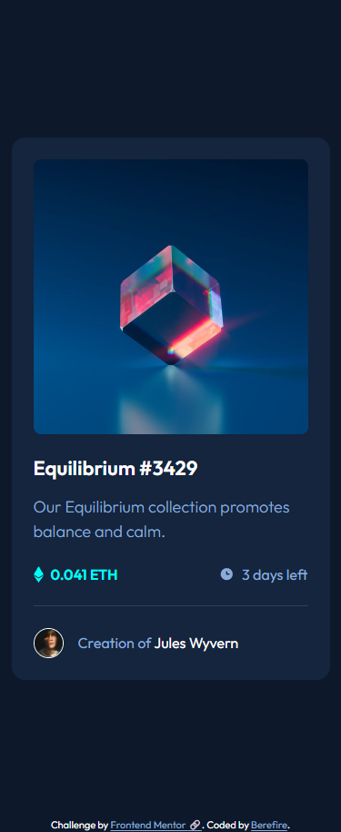
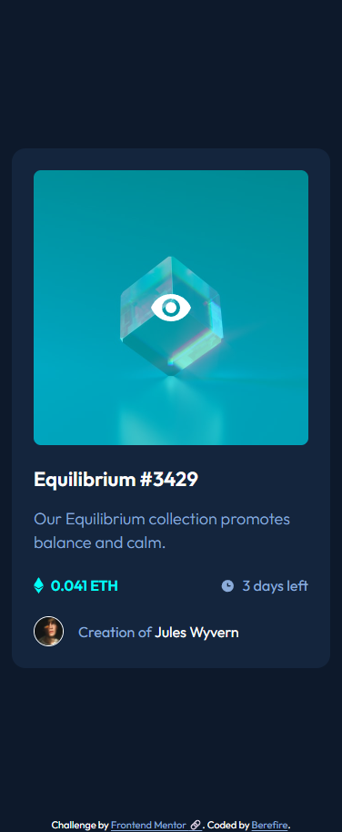
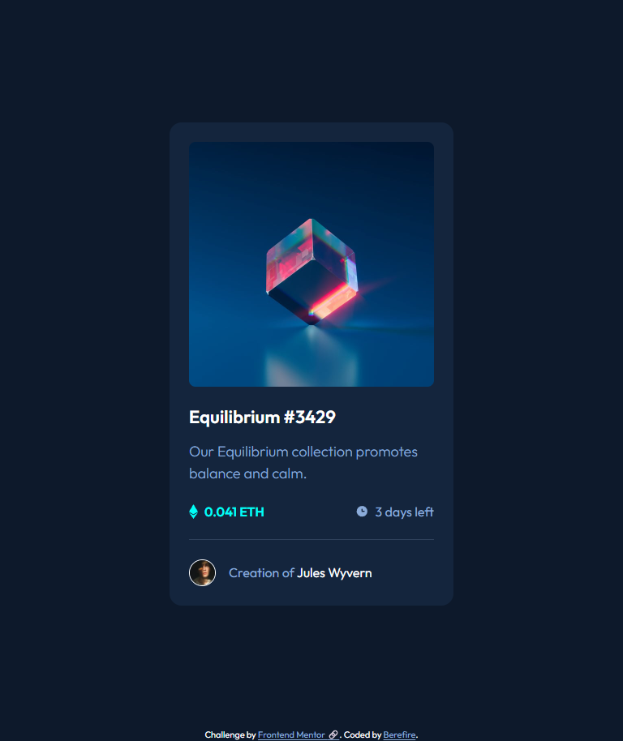
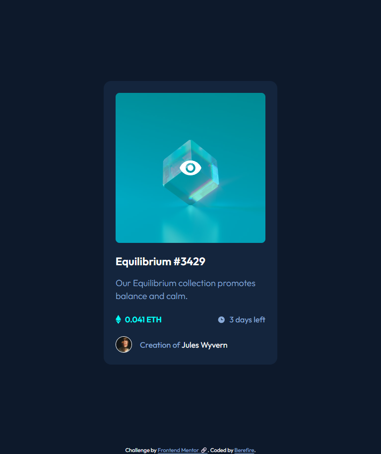
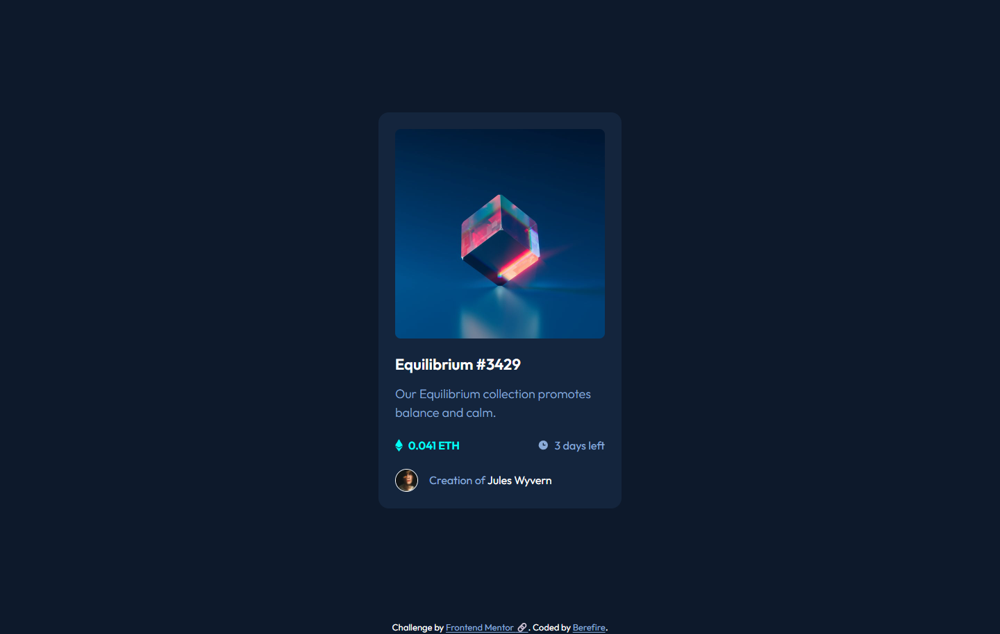
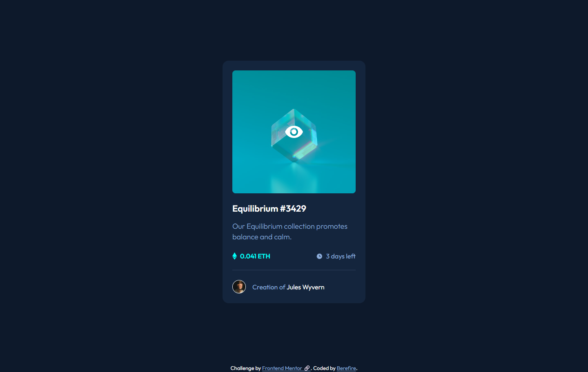

# Frontend Mentor - NFT preview card component solution


[](https://www.frontendmentor.io/)
[](https://vitejs.dev)


[](./assets/downloads/lighthouse-performance-report.pdf)

This is a solution to the [NFT preview card component challenge on Frontend Mentor](https://www.frontendmentor.io/challenges/nft-preview-card-component-SbdUL_w0U). Frontend Mentor challenges help you improve your coding skills by building realistic projects. 

## Table of contents

- [Overview](#overview)
  - [The challenge](#the-challenge)
  - [Screenshot](#screenshot)
  - [Links](#links)
- [My process](#️my-process)
  - [Built with](#built-with)
  - [What I learned](#what-i-learned)
  - [Continued development](#continued-development)
  - [Useful resources](#useful-resources)
- [Author](#author)
- [Acknowledgments](#acknowledgments)

---

## 📖Overview

### The challenge

Users should be able to:

- View the optimal layout depending on their device's screen size
- See hover states for interactive elements

---

### 📸Screenshot

#### Mobile (375x914)

| _Main_ | _Active_ |
| ------ | -------- |
|  |  |

#### Tablet (768x914)

| _Main_ | _Active_ |
| ------ | -------- |
|  |  |

#### Desktop (1440x914)

| _Main_ | _Active_ |
| ------ | -------- |
|  |  |

---

### 🔗Links

- Solution URL: [Add solution URL here](https://your-solution-url.com)
- Live Site URL: [https://berefire.github.io/nft-preview-card-component-main/](https://berefire.github.io/nft-preview-card-component-main/)

---

## ⚙️My process

### 🛠Built with

- Semantic HTML5 markup
- Modern CSS
- CSS custom properties
- Flexbox
- Mobile-first workflow
- CUBE CSS architecture
- BEM naming convention
- Accessible focus and hover states

---

### 💡What I learned

This project helped me reinforce the importance of combining semantic HTML with accessible interactions.

One area I focused on was creating an accessible interactive image overlay while keeping decorative elements hidden from assistive technologies.

```html
<a href="#" class="card__link"> 
   
  <span class="card__overlay" aria-hidden="true"> 
    <!-- Decorative icon --> 
     </span> 
</a>
```

I also practiced combining CUBE CSS utilities with BEM component classes:

```html
<article class="card box box--lg radius radius--md">
```

This approach helped keep the component styles modular, reusable, and easy to maintain.

---

### 🚀Continued development

In future projects, I want to continue improving:

- Accessibility-first development practices.
- Semantic HTML structure.
- Component architecture using CUBE CSS.
- Creating reusable utility classes.
- Writing scalable and maintainable CSS.

---

### 📚Useful resources

- [https://cube.fyi/](https://cube.fyi/) - A great resource for learning CUBE CSS and creating scalable stylesheets.
- [https://developer.mozilla.org/](https://developer.mozilla.org/) - My primary reference for HTML, CSS, and accessibility documentation.
- [https://www.w3.org/WAI/](https://www.w3.org/WAI/) - Helpful accessibility guidance and best practices.

---

### 🤖AI Collaboration

AI tools were used throughout development as a learning aid, code review partner, and accessibility consultant.

---

#### Tools AI Was Used

- ChatGPT

#### How AI Was Used

- Reviewing semantic HTML structure.
- Discussing accessibility best practices.
- Evaluating ARIA usage and interactive states.
- Reviewing CSS architecture decisions.
- Refining CUBE CSS and BEM integration.
- Improving component organization and maintainability.
- Generating project documentation and metadata.
- Identifying potential usability and accessibility issues.

#### What Worked Well

- Accessibility-focused code reviews.
- Semantic HTML recommendations.
- CSS architecture discussions.
- Exploring alternative implementation approaches.
- Identifying opportunities to simplify code.
- Documentation and README generation.

#### What Didn't Work Well

- AI suggestions occasionally required adaptation to fit the project's architecture.
- Accessibility recommendations still needed verification through manual testing.
- Generated code and feedback required validation against project requirements and browser behavior.

AI was used as a collaborative learning and review tool rather than a replacement for implementation, testing, debugging, or decision-making.

---

## 👤Author

- Frontend Mentor - [@berefire](https://www.frontendmentor.io/profile/berefire)
- GitHub - [@berefire](https://github.com/berefire)

---

## 🙏Acknowledgments

Thanks to Frontend Mentor for providing practical challenges that help developers improve real-world frontend skills.

---
